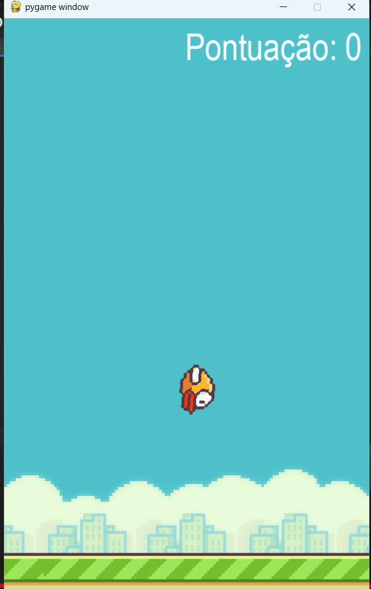
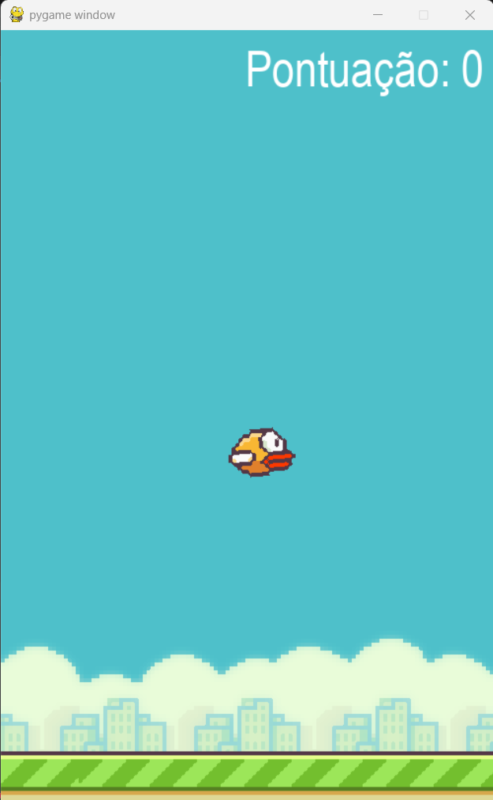
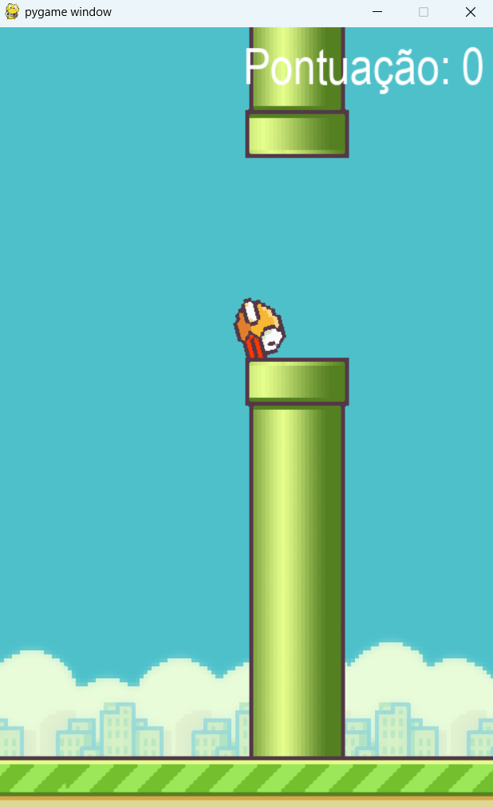

# 🐦 Flappy Bird Clone com Pygame


Este projeto é um clone do clássico jogo Flappy Bird, desenvolvido inteiramente em Python com o uso da biblioteca Pygame.

---

## 📸 Galeria do Jogo

<p align="center">
  
  
  
</p>


---

## 🎯 Objetivo

O objetivo deste projeto é aplicar e demonstrar conceitos de desenvolvimento de jogos 2D e Programação Orientada a Objetos (POO) em um ambiente prático e interativo.

---

## ⚙️ Funcionalidades

-   **Movimentação do Pássaro:** O jogador controla o pássaro com a tecla de espaço para fazê-lo pular.
-   **Física Simples:** O pássaro é constantemente afetado por uma força de gravidade que o puxa para baixo.
-   **Geração Procedural de Canos:** Os canos são gerados continuamente em alturas aleatórias, criando um desafio infinito.
-   **Detecção de Colisão:** O jogo termina se o pássaro colidir com um cano ou com o chão.
-   **Sistema de Pontuação:** O jogador ganha um ponto a cada vez que passa por um par de canos.

---

## 🛠️ Estrutura do Código (POO)

O projeto foi estruturado utilizando Programação Orientada a Objetos para organizar a lógica:
-   **`Passaro`**: Classe que controla o estado, a imagem e a movimentação do jogador.
-   **`Cano`**: Classe responsável por criar, movimentar e desenhar os obstáculos.
-   **`Chao`**: Classe que gerencia a animação do chão se movendo continuamente.

---

## ⚙️ Instalação

Para executar este projeto, você precisa ter o Python e o Pygame instalados.
```bash
pip install pygame

---

## 🚀 Como Jogar

1.  Certifique-se de que todos os arquivos de imagem e fonte estejam na pasta `assets/`.
2.  Execute o script principal no seu terminal:
    ```bash
    python flappy_bird.py
    ```
3.  Use a **tecla de espaço** para fazer o pássaro pular.
4.  Tente fazer a maior pontuação possível!